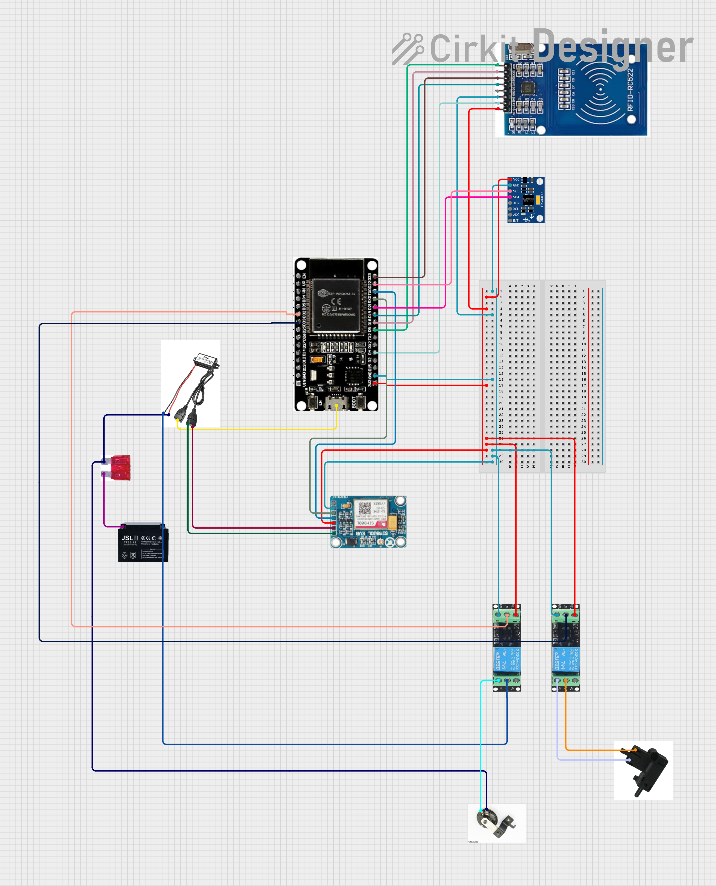

# MOTOGUARD - Antifurto moto intelligente

Sistema antifurto avanzato per moto, basato su ESP32.

L’obiettivo è proteggere il veicolo tramite una logica hardware/software completamente integrata, in grado di rilevare intrusioni, bloccare l’accensione e notificare tempestivamente il proprietario.

Il montaggio è volutamente reso estremamente semplice da effettuare, non invasivo rispetto al cablaggio originale.

### Features:

- Attivazione/Blocco tramite tag RFID
- Rilevazione movimento
- Attivazione clacson originale moto
- Blocco accensione motore
- Notifica il proprietario tramite SMS e Chiamata.
- Gestione remota del sistema tramite appositi comandi SMS

### Componenti Hardware

- **WEMOS ESP32 con porta batteria 18650**
- **Modulo GSM SIM800L**
- **Accelerometro/Giroscopio MPU6050**
- **Modulo RFID RC522 + TAG MIFARE**
- **2X Relè 3.3V**
- **Portafusibile e fusibile 10A per protezione del circuito.**

---

### Schematica

Licenza: GNU General Public License v3.0
---
Emiddio Ingenito [emikodes-UniMI](https://github.com/emikodes-UniMI) [emikodes](https://github.com/emikodes)
